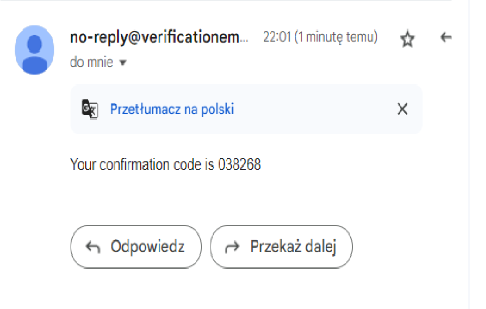

# Tomasz Koralewski - Cognito User Pool, Tic Tac Toe Report

- Course: *Cloud programming*
- Group: W04IST-SI0828G # L # Programowanie w chmurze – Lab
- Date: 6/6/2024

## Architektura środowiska

Infrastruktura opracowana w tym projekcie wykorzystuje kilka usług AWS, zorkiestrowanych za pomocą Terraform, aby hostować prostą grę TicTacToe. Architektura została zaprojektowana z myślą o skalowalności i bezpieczeństwie.

### AWS VPC (Virtual Private Cloud)

Podstawą architektury sieciowej jest VPC `my_vpc` z blokiem CIDR `10.0.0.0/16`. VPC zapewnia podstawową infrastrukturę sieciową, umożliwiając izolację i zarządzanie zasobami w chmurze. Włączono wsparcie DNS oraz nazwy hostów, co ułatwia lepsze rozwiązywanie nazw w ramach sieci.

### Subnety

W ramach VPC utworzono dwa subnety:
- **Publiczny subnet**: Zlokalizowany w strefie dostępności `us-east-1a` z blokiem CIDR `10.0.101.0/24`, zaprojektowany do umożliwienia publicznego dostępu. To tutaj znajduje się instancja EC2 serwera gry, która potrzebuje bezpośredniego dostępu do internetu.
- **Prywatny subnet**: Zlokalizowany w strefie dostępności `us-east-1b` z blokiem CIDR `10.0.102.0/24`, przeznaczony dla wewnętrznych usług, które nie wymagają bezpośredniego dostępu do internetu. 

### Internet Gateway

Internet gateway `igw` jest podłączony do VPC, co umożliwia komunikację między zasobami w publicznym subnecie a internetem. Gateway działa jako punkt wejścia i wyjścia dla ruchu internetowego.

### Tablice routingu

Utworzono tablicę routingu `public_route_table` przypisaną do publicznego subnetu, która kieruje cały ruch internetowy do internet gateway. Dzięki temu wszystkie zasoby w publicznym subnecie mogą komunikować się z internetem.

### Grupy zabezpieczeń

Grupa zabezpieczeń `server_sg` została skonfigurowana w celu zdefiniowania zasad ruchu przychodzącego i wychodzącego do instancji EC2. Grupa ta pozwala na ruch SSH, HTTP oraz WebSocket, zapewniając jednocześnie bezpieczeństwo poprzez ograniczenie dostępu tylko do niezbędnych portów.

### Zasoby Cognito

AWS Cognito zostało użyte do zarządzania uwierzytelnianiem użytkowników. Utworzono pulę użytkowników `TicTacToeUserPool`, która obsługuje użytkowników gry, oraz klienta puli użytkowników `TicTacToeAppClient`, który umożliwia aplikacji interakcję z Cognito. Użytkownicy są automatycznie weryfikowani za pomocą adresu email, a polityka haseł zapewnia minimalny poziom bezpieczeństwa.

### Instancja EC2

Instancja EC2 `TicTacToeServer` jest uruchomiona w publicznym subnecie i skonfigurowana do hostowania gry TicTacToe. Instancja korzysta z systemu Ubuntu, a w ramach jej konfiguracji zainstalowano Node.js, npm oraz Nginx. Kod gry jest klonowany z repozytorium GitHub, a następnie uruchamiany w tle. Nginx jest skonfigurowany do serwowania plików frontendu, co umożliwia użytkownikom interakcję z grą za pośrednictwem przeglądarki internetowej.

### Podsumowanie

Konfiguracja infrastruktury przy użyciu Terraform i AWS zapewnia skalowalne i bezpieczne środowisko dla gry TicTacToe. VPC zapewnia izolację sieciową, subnety umożliwiają rozdzielenie zasobów publicznych i prywatnych, internet gateway i tablice routingu umożliwiają komunikację z internetem, grupy zabezpieczeń kontrolują ruch sieciowy, a zasoby Cognito zarządzają uwierzytelnianiem użytkowników. Wszystkie te elementy razem tworzą kompleksowe i efektywne rozwiązanie do hostowania aplikacji webowej.

### Podgląd

Zrzuty ekranu aplikacji demonstrują pomyślne wdrożenie i funkcjonowanie gry TicTacToe hostowanej na infrastrukturze AWS. Zrzuty ekranu obejmują wynik zastosowania Terraform, sesje gry oraz widoki konsoli AWS dla uruchomionej instancji EC2 i jej konfiguracji.

Zrzut ekranu działających instancji EC2:

Zrzut ekranu grup zabezpieczeń:

Zrzut ekranu puli użytkowników Cognito:

Zrzut ekranu podczas rejestracji:

Zrzut ekranu z potwierdzeniem e-mail:

Zrzut ekranu podczas weryfikacji:

Zrzut ekranu podczas logowania:

Zrzut ekranu z otrzymanym tokenem IdToken:

Zrzut ekranu podczas gry:

Zrzut ekranu podczas wylogowywania:

### Refleksje i wnioski

#### Korzystanie z AWS Cognito

AWS Cognito jest potężnym narzędziem do zarządzania uwierzytelnianiem użytkowników oraz autoryzacją w aplikacjach internetowych i mobilnych. Integracja Cognito z aplikacją TicTacToe była relatywnie prosta i intuicyjna, co znacząco przyspieszyło proces wdrażania funkcji związanych z zarządzaniem użytkownikami.

**Zalety korzystania z Cognito:**
1. **Łatwość integracji:** AWS Cognito oferuje gotowe do użycia funkcje API, które można łatwo zintegrować z aplikacją, co oszczędza czas i wysiłek programistyczny.
2. **Bezpieczeństwo:** Cognito zapewnia wysokie standardy bezpieczeństwa, w tym zarządzanie tożsamościami i dostępem, co jest kluczowe dla ochrony danych użytkowników.
3. **Automatyzacja:** Automatyczne zarządzanie procesami rejestracji, weryfikacji email oraz logowania użytkowników sprawia, że zarządzanie użytkownikami staje się mniej obciążające.
4. **Skalowalność:** Cognito jest skalowalne, co oznacza, że można go używać w małych aplikacjach, jak i dużych systemach z milionami użytkowników.

#### Czego się nauczyłam/em?

Podczas tego projektu nauczyłam/em się:
- Jak konfigurować i zarządzać infrastrukturą AWS za pomocą Terraform.
- Jak zintegrować AWS Cognito z aplikacją Node.js.
- Jak konfigurować i zarządzać instancjami EC2, grupami zabezpieczeń oraz innymi zasobami AWS.

#### Napotkane trudności

Wyzwaniem z początku było poprawne skonfigurowanie AWS Cognito i zintegrowanie go z aplikacją, aby wszystkie funkcje działały zgodnie z oczekiwaniami, jednakże udało osiągnąć się ten cel.

#### Co mnie najbardziej zaskoczyło?

Najbardziej zaskoczyła mnie elastyczność i łatwość integracji AWS Cognito. Mimo początkowych trudności z konfiguracją, okazało się, że Cognito jest bardzo wszechstronnym narzędziem, które znacznie upraszcza zarządzanie użytkownikami i ich autoryzacją w aplikacjach.

### Podsumowanie

Projekt ten dostarczył mi cennych doświadczeń związanych z wykorzystaniem Terraform i AWS do budowy skalowalnych i bezpiecznych aplikacji webowych. AWS Cognito okazało się niezastąpionym narzędziem w zakresie zarządzania tożsamościami użytkowników, a jego łatwość użycia i wysoki poziom bezpieczeństwa sprawiają, że jest to idealne rozwiązanie dla nowoczesnych aplikacji.
